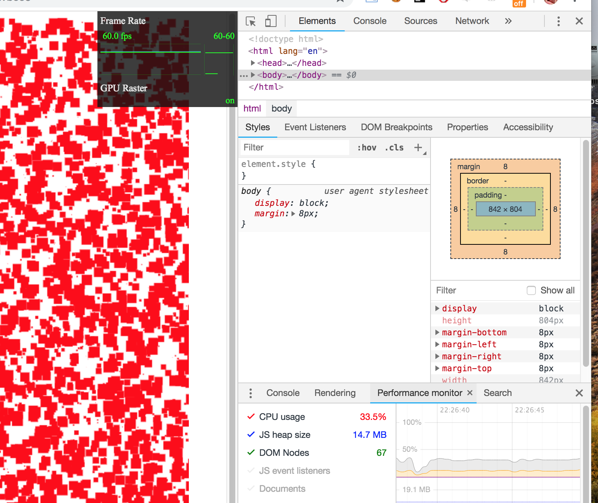
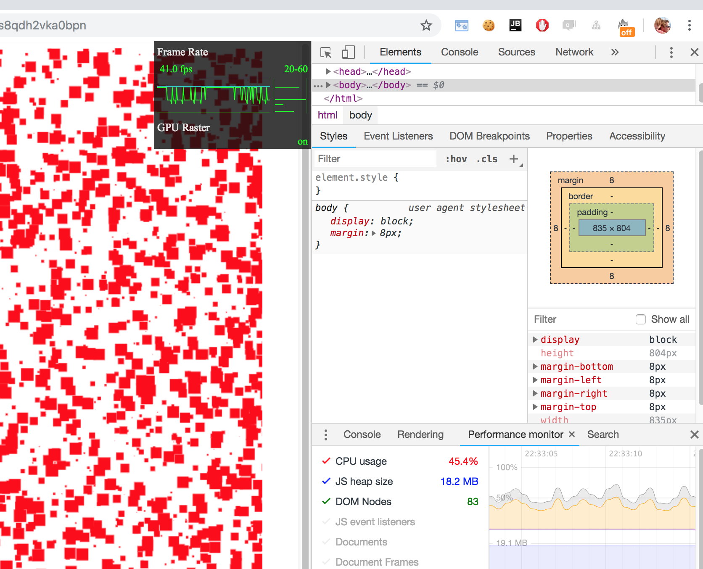
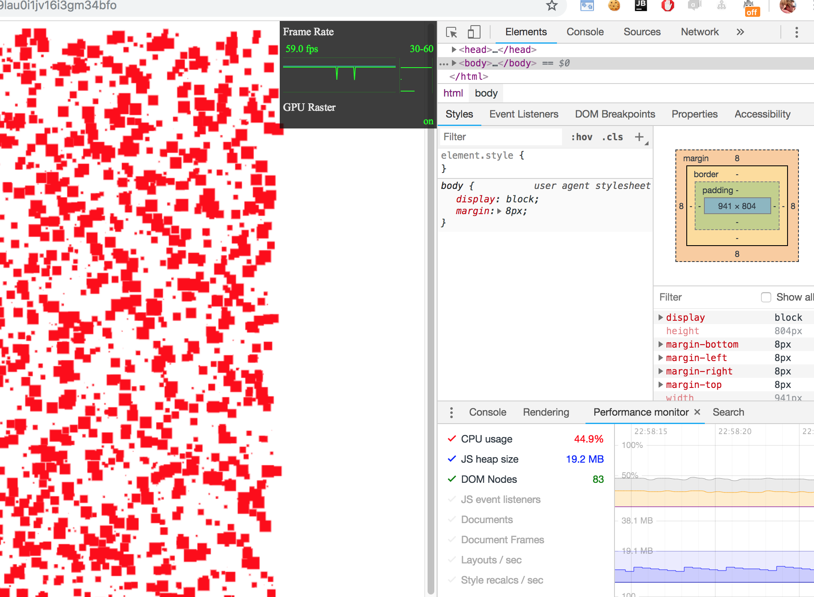

Small project to compare the performance when rendering a rectangle:

1. using only `fillRect(x,y,w,h)`
2. using save `translate` before `fillRect(.0,.0, w, h)`
2. using `Matrix.translate.applyOn(context)` before `fillRect(.0,.0, w, h)`

With 4000 rectangles rendered:
1. 60 FPS 33% CPU
2. 40 FPS 50% CPU
3. 60 FPS 44% CPU

